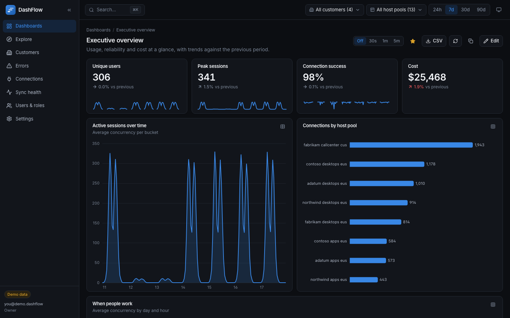
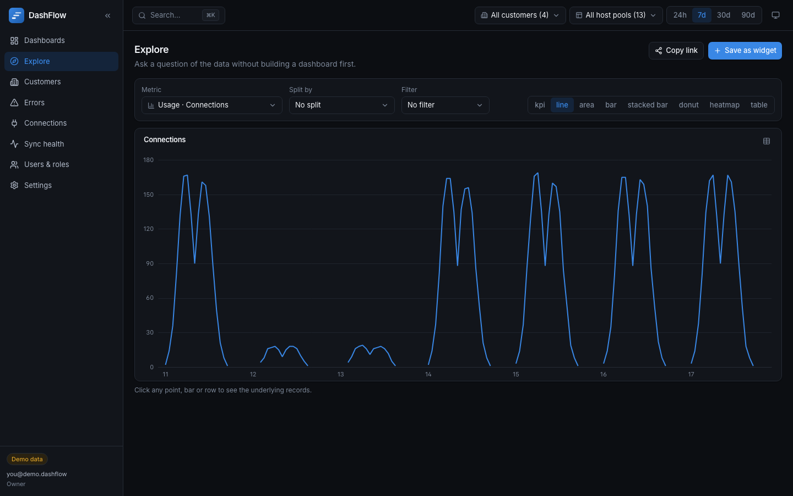
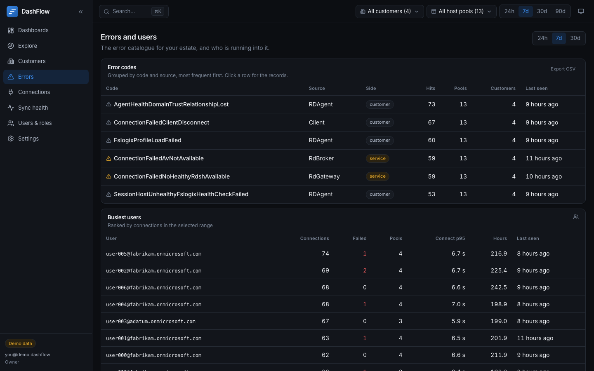
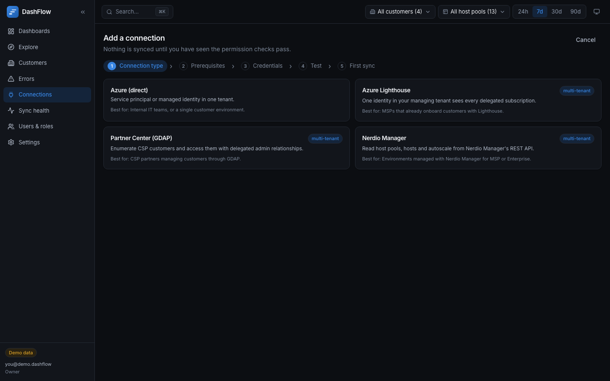
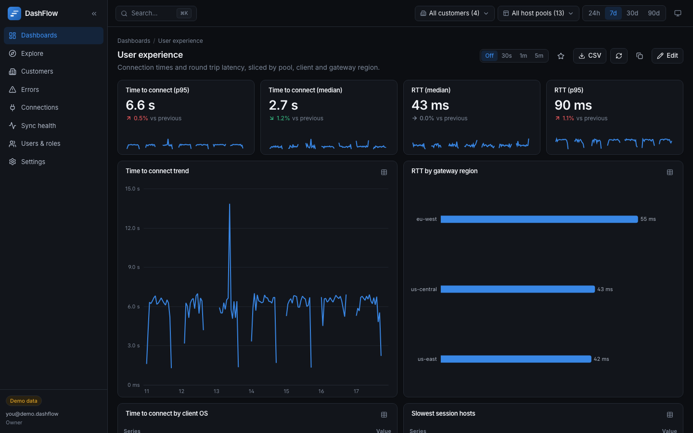
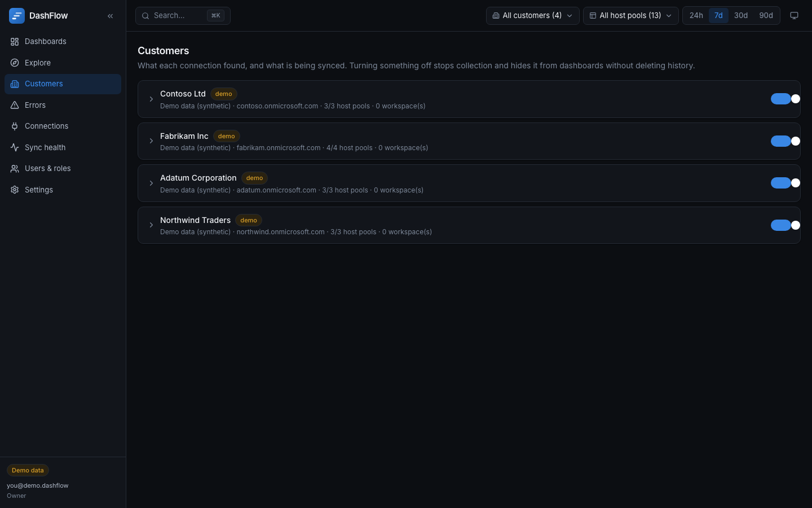

<div align="center">


### Open-source dashboards for Azure Virtual Desktop

One container. Your tenant. Every customer.

[**▶ Try the live demo**](https://bg-red.github.io/dashflow/) · [Quickstart](#quickstart) · [Deploy to Azure](#deploy-to-azure) · [Docs](docs/) · [Contributing](CONTRIBUTING.md)

[](https://github.com/BG-Red/dashflow/actions/workflows/ci.yml)
[](https://bg-red.github.io/dashflow/)
[](LICENSE)
[](https://github.com/BG-Red/dashflow/pkgs/container/dashflow)
[](https://bun.sh)



</div>

---

DashFlow reads Azure Virtual Desktop data **directly from Azure** or **through Nerdio Manager**,
stores it in your own Postgres, and turns it into dashboards you can build in about a minute.
It is built for people who run AVD for more than one tenant: a service principal, an **Azure
Lighthouse** managing tenant, **Partner Center (GDAP)** customers and **Nerdio Manager for MSP**
accounts all feed the same dashboards.

No SaaS. No telemetry. No data leaving your tenant.

## Why it exists

AVD Insights answers "is this host pool healthy". It does not answer "which of my 30 customers
had a bad week, and what did it cost them". Workbooks can get you there, but you rebuild them
per customer — and nobody wants to hand a customer a Workbook.

DashFlow is the piece in between: a real product surface over data you already have, with
multi-tenancy, roles and a customer-facing view built in.

|  | AVD Insights | Azure Workbooks | Nerdio reporting | **DashFlow** |
|---|---|---|---|---|
| Many tenants in one view | ✗ | with effort | per instance | **✓** |
| Lighthouse / GDAP aware | ✗ | ✗ | partial | **✓** |
| Azure **and** Nerdio together | ✗ | ✗ | ✗ | **✓** |
| Share one customer's view with them | ✗ | ✗ | ✗ | **✓ scoped viewers** |
| Runs in your own tenant | ✓ | ✓ | ✓ | **✓** |
| Open source | ✗ | ✗ | ✗ | **✓ MIT** |

## What you get

**Guided dashboards.** Pick a question — usage, experience, reliability, capacity, cost — preview
the answer against your own data, then adjust. Drag and resize widgets, filter them per
dimension, and click any point to see the records behind it.

**Explore.** Ask something the templates do not cover: pick a metric, split it, filter it, look
at it. The question lives in the URL, so sharing it is a copy and paste, and saving it onto a
dashboard is one click.



**An error catalogue that leads somewhere.** Every AVD error code you are actually hitting,
ranked, with the host pools and customers affected — and the busiest users right beside it,
because that is always the next question.



**Setup that proves itself.** The connection wizard generates the exact `az` commands for the
roles it needs, then runs a permission checklist — including the traps, like GDAP granting Entra
roles but not Azure RBAC. Nothing syncs until you have seen it pass.



Also in the box: a ⌘K command palette, light and dark themes that were each designed rather than
inverted, CSV export everywhere, host pool and session host pages with health timelines,
per-customer viewer roles, and a sync health screen that streams progress live.

## Quickstart

```bash
git clone https://github.com/BG-Red/dashflow.git
cd dashflow
docker compose up --build
```

Open <http://127.0.0.1:3000>. Demo mode generates four synthetic customers with 30 days of
history, so every dashboard has something in it from the first second.

<details>
<summary>Prefer Bun directly?</summary>

```bash
bun install
cp .env.example .env            # set DATABASE_URL and APP_ENCRYPTION_KEY
bun run db:migrate
bun run build
bun run start
```

</details>

## Deploy to Azure

[](https://portal.azure.com/#create/Microsoft.Template/uri/https%3A%2F%2Fraw.githubusercontent.com%2FBG-Red%2Fdashflow%2Fmain%2Finfra%2Fazuredeploy.json)

The script does the whole thing, including the parts the portal cannot (making the app's managed
identity a Postgres administrator):

```bash
IMAGE=ghcr.io/bg-red/dashflow:latest ./infra/deploy.sh
```

That creates a Container Apps environment with **Container Apps authentication (EasyAuth)** in
front of the app, a user-assigned managed identity, Key Vault, and a Postgres Flexible Server
with **Entra-only auth** — so no database password exists anywhere.

See [docs/deploy.md](docs/deploy.md) for the app registration, and
[docs/security.md](docs/security.md) for exactly what the app trusts and why.

## How it fits together

```
                  ┌──────────────── Azure Container Apps ─────────────────┐
  browser ──TLS──▶│ EasyAuth sidecar ──▶ web (Bun · Hono · React)         │
                  │                             │                        │
                  │                    Postgres (Entra auth)             │
                  │                             ▲                        │
                  │ worker (same image, APP_ROLE=worker) ──▶ connectors ──┼──▶ ARM · Log Analytics
                  └───────────────────────────────────────────────────────┘     Cost Management
                                                                                Partner Center
                                                                                Nerdio REST API
```

| Package | What it holds |
|---|---|
| `packages/core` | The metric catalog, dashboard templates, roles and schemas — the only things that become SQL |
| `packages/db` | Drizzle schema and migrations |
| `packages/connectors` | One `test` / `discover` / `sync` interface, five implementations |
| `packages/demo` | The synthetic estate, plus the JavaScript evaluator behind the hosted demo |
| `apps/server` | API, EasyAuth, the query engine, a Postgres job queue and the sync worker |
| `apps/web` | The React app |

## Connections

| | How it reaches your data | Use it when |
|---|---|---|
| **Azure (direct)** | Service principal, or the container's managed identity | One tenant — internal IT, or a single customer |
| **Azure Lighthouse** | One identity in your managing tenant, projected into delegated subscriptions | You already onboard customers with Lighthouse |
| **Partner Center (GDAP)** | Partner admin consent once, then per-customer tokens | CSP partners with GDAP relationships |
| **Nerdio Manager** | Nerdio's REST API with client credentials | Environments managed by Nerdio Manager (MSP or Enterprise) |

Azure and Nerdio records about the same host pool merge on the ARM resource ID, so running both
puts Nerdio's autoscale view next to Azure's connection telemetry.

[docs/connections.md](docs/connections.md) covers each type; [docs/permissions.md](docs/permissions.md)
lists the exact roles — all of them read-only.

## What it collects

| Stream | Source | Default interval |
|---|---|---|
| Inventory — pools, hosts, app groups, scaling plans | ARM `Microsoft.DesktopVirtualization` | hourly |
| Sessions — concurrency, capacity, host health | ARM session and user sessions | 5 minutes |
| Connections, errors, latency, CPU | Log Analytics (`WVDConnections`, `WVDErrors`, `WVDConnectionNetworkData`, `Perf`) | 15 minutes, incremental |
| Cost | Cost Management query API | daily |

User names are hashed with a per-instance salt by default, so per-user counts work without
storing identities. Retention is per connection, and a daily job enforces it.

## Two things worth knowing

**Tenant scope is enforced where the SQL is built, not in the UI.** Widgets reference metric IDs
from a catalog that lives in code; every value a user can influence is a bound parameter. A
viewer scoped to one customer who asks for another gets zero rows — not everything. Tests assert
exactly that, including one that throws SQL injection at a dashboard filter.

**The demo cannot drift from the product.** The hosted demo computes its numbers in JavaScript
because it has no database — and CI runs that evaluator and the real SQL engine over the same
generated rows, failing if any metric, percentile or bucket disagrees.

## Light theme, and the customer view

| Light | Customers |
|---|---|
|  |  |

## Roadmap

See [ROADMAP.md](ROADMAP.md). Next: alert rules with webhook and Teams delivery, scheduled
customer reports, and a Nerdio autoscale-history connector once those endpoints are confirmed
against a live instance.

## Contributing

Issues and pull requests are welcome — see [CONTRIBUTING.md](CONTRIBUTING.md). Install
[gitleaks](https://github.com/gitleaks/gitleaks) before your first commit: the pre-commit hook
uses it to keep tenant IDs, domains and secrets out of the repository, and CI enforces the same
rules across the full history.

```bash
bun test              # unit tests; set TEST_DATABASE_URL to include the SQL and parity suites
bunx playwright test  # end-to-end, against the demo build
bun run lint && bun run typecheck
```

---

<div align="center">

MIT licensed · Not affiliated with Microsoft or Nerdio · "Azure Virtual Desktop" and "Nerdio"
are their owners' trademarks

</div>
